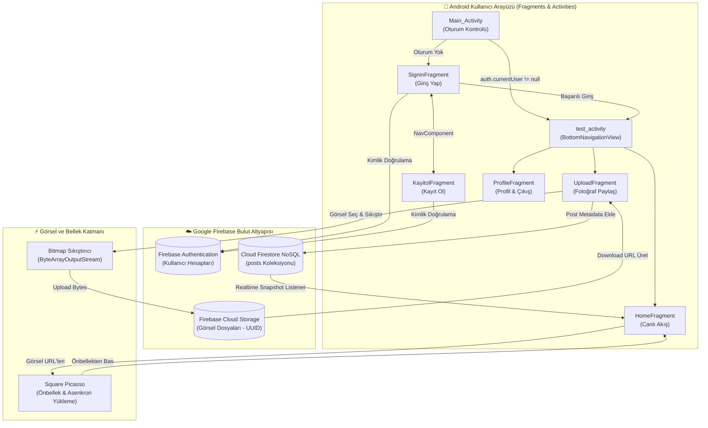

# 📸 Kotlin Instagram Clone (Android & Firebase)

[](https://kotlinlang.org/)
[](https://developer.android.com/)
[](https://firebase.google.com/)
[](https://developer.android.com/topic/libraries/view-binding)
[](https://developer.android.com/guide/navigation)
[](https://square.github.io/picasso/)
[](LICENSE)

Android platformunda **Kotlin** programlama dili ve **Google Firebase** bulut altyapısı kullanılarak geliştirilmiş, gerçek zamanlı fotoğraf paylaşımı ve sosyal ağ deneyimi sunan tam teşekküllü bir **Instagram Klonu Mobil Uygulaması**dır.

Proje; kullanıcı kimlik doğrulama döngüsünden görsel seçimi ve buluta yükleme süreçlerine, Firestore gerçek zamanlı veri akışından (Realtime Feed) modern Fragment navigasyonu ve profil yönetimine kadar modern bir Android uygulamasında bulunması gereken tüm mimari prensipleri barındırır.

---

## ✨ Temel Özellikler

### 🔐 1. Firebase Authentication & Oturum Yönetimi
- **Kayıt ve Giriş Sistemi:** `FirebaseAuth` altyapısı ile güvenli e-posta ve parola tabanlı kullanıcı kaydı (`createUserWithEmailAndPassword`) ve girişi (`signInWithEmailAndPassword`).
- **Kalıcı Oturum Kontrolü:** `auth.currentUser` kontrolü sayesinde kullanıcı daha önce oturum açtıysa her açılışta tekrar parola sormadan doğrudan ana akışa yönlendirilir.
- **Güvenli Oturum Kapatma:** Profil ekranından tek tıkla oturumu sonlandırma (`auth.signOut()`) ve giriş ekranına dönüş.

### 📤 2. Fotoğraf Yükleme & Bulut Depolama (Upload Engine)
- **Çalışma Zamanı İzin Yönetimi (Runtime Permissions):** Android 13+ (API 33+) için `READ_MEDIA_IMAGES` ve önceki sürümler için `READ_EXTERNAL_STORAGE` izinlerini dinamik olarak denetler; reddedilme durumunda kullanıcıya açıklayıcı `Snackbar` sunar.
- **Modern Activity Result API:** Kullanımdan kalkan yapılar yerine modern `ActivityResultLauncher` ve `ActivityResultContracts` ile galeriden güvenli görsel seçimi.
- **Görsel Sıkıştırma (Image Compression):** Bellek tasarrufu sağlamak için seçilen görseli `Bitmap` üzerinden boyutlandırıp `ByteArrayOutputStream` ile optimize ederek buluta aktarır.
- **Firebase Cloud Storage:** Her görsele `UUID.randomUUID()` ile benzersiz dosya adı atanarak Cloud Storage üzerinde güvenle arşivlenir ve genel erişim linki (`download_url`) üretilir.
- **Metadata Kaydı:** Gönderi açıklaması, kullanıcı adı/e-postası ve `Timestamp.now()` zaman damgasıyla birlikte Cloud Firestore'a kaydedilir.

### 🔄 3. Gerçek Zamanlı Canlı Akış (Realtime Feed)
- **Canlı Senkronizasyon (Snapshot Listener):** Cloud Firestore'un `addSnapshotListener` dinleyicisi sayesinde sayfayı yenilemeye gerek kalmadan, veritabanına eklenen yeni gönderiler anında tüm kullanıcıların akışına düşer.
- **Kronolojik Sıralama:** Gönderiler paylaşım zamanına göre en yeniden en eskiye doğru azalan sırada (`orderBy("date_time", Query.Direction.DESCENDING)`) listelenir.

### 🖼️ 4. Performanslı Görsel Önbellekleme (Square Picasso)
- Firebase Cloud Storage'dan gelen yüksek çözünürlüklü görseller, **Square Picasso** kütüphanesi ile arka planda asenkron olarak indirilir. Bellek ve disk önbelleklemesi (caching) sayesinde kaydırma esnasında donma veya gecikme yaşanmaz.

### 🧭 5. Modern Navigasyon & Arayüz Mimarisi
- **Jetpack Navigation Component & SafeArgs:** Giriş ve kayıt ekranları arasında fragment geçişleri Navigation Graph (`navigator.xml`) üzerinden yönetilir.
- **Material BottomNavigationView:** Ana ekranda (`test_activity`) akış, paylaşım ve profil sekmeleri arasında akıcı geçiş:
  - 🏠 **HomeFragment:** Gerçek zamanlı gönderi akışı (Feed).
  - ➕ **UploadFragment:** Fotoğraf seçme, açıklama yazma ve paylaşma.
  - 👤 **ProfileFragment:** Kullanıcı profili, biyografi düzenleme ve oturumu kapatma.
- **ViewBinding:** XML arayüz bileşenlerine erişimde sıfır hata ve tam tip güvenliği.

---

## 🏛️ Mimari ve Veri Akış Şeması



---

## ☁️ Firestore Veritabanı Şeması

Uygulama, Firestore üzerinde **`posts`** koleksiyonu altında doküman tabanlı çalışır:

| Alan (Field) | Veri Tipi | Açıklama |
|---|---|---|
| `name` | `String` | Gönderiyi paylaşan kullanıcının adı veya e-postası |
| `comment` | `String` | Gönderiye eklenen açıklama / metin |
| `download_url` | `String` | Firebase Storage üzerindeki görselin genel indirme bağlantısı |
| `date_time` | `Timestamp` | Gönderinin paylaşılma anı (Sıralama için kullanılır) |

---

## 🛠️ Kullanılan Teknolojiler & Kütüphaneler

| Teknoloji | Versiyon / Rol |
|---|---|
| **Kotlin** | Temel Programlama Dili |
| **Android SDK** | Min SDK 29 (Android 10) / Target SDK 34–36 |
| **Jetpack ViewBinding** | Tip Güvenli Görünüm Bağlama |
| **Jetpack Navigation** | SafeArgs ile Fragment Navigasyonu |
| **Firebase BoM** | `33.7.0` (Bileşen Versiyon Yönetimi) |
| **Firebase Auth** | E-posta/Şifre ile Kimlik Doğrulama |
| **Cloud Firestore** | Gerçek Zamanlı NoSQL Veritabanı |
| **Cloud Storage** | Bulut Medya Depolama |
| **Square Picasso** | `2.8` (Asenkron Görsel İndirme & Önbellek) |
| **Material Components** | Modern UI Tasarımı & BottomNavigationView |

---

## 🚀 Kurulum ve Çalıştırma

### Gereksinimler
- [Android Studio](https://developer.android.com/studio) (Koala / Ladybug / Iguana veya üzeri)
- Android SDK (API 29+)
- Aktif bir [Firebase](https://firebase.google.com/) projesi

### Adım Adım Kurulum

1. **Projeyi Klonlayın:**
   ```bash
   git clone https://github.com/enesduvan/Kotlin_instagram.git
   cd Kotlin_instagram
   ```

2. **Firebase Yapılandırması:**
   - [Firebase Console](https://console.firebase.google.com/) üzerinden yeni bir Android projesi oluşturun.
   - Paket adı olarak `com.enesduvan.kotlin_instagram` girin.
   - Firebase Console'dan indireceğiniz **`google-services.json`** dosyasını projenin `Kotlin_instagram/app/` dizinine yerleştirin.
   - Firebase Console üzerinden **Authentication (Email/Password)**, **Cloud Firestore** ve **Cloud Storage** servislerini aktif edin.

3. **Android Studio ile Açın:**
   - Projeyi Android Studio ile açın ve Gradle senkronizasyonunu (`Sync Project with Gradle Files`) tamamlayın.

4. **Çalıştırın:**
   - Fiziksel cihazınızı veya Android Emülatörünü seçip yeşil **Run 'app'** (▶️) butonuna tıklayın.

---

## 📂 Proje Dizin Yapısı

```plaintext
Kotlin_instagram/
├── README.md                             # Detaylı Proje Dokümantasyonu
├── .gitignore                            # Android & Gradle Hariç Tutma Listesi
└── Kotlin_instagram/
    ├── app/
    │   ├── src/main/
    │   │   ├── java/com/enesduvan/kotlin_instagram/
    │   │   │   ├── Main_Activity.kt      # Oturum Kontrolü & Başlatıcı Activity
    │   │   │   ├── test_activity.kt      # BottomNavigation Ana Taşıyıcı Activity
    │   │   │   ├── SigninFragment.kt     # Kullanıcı Giriş Ekranı
    │   │   │   ├── KayitolFragment.kt    # Yeni Kullanıcı Kayıt Ekranı
    │   │   │   ├── HomeFragment.kt       # Canlı Akış (Realtime Feed) Ekranı
    │   │   │   ├── UploadFragment.kt     # Fotoğraf Seçme & Yükleme Ekranı
    │   │   │   ├── ProfileFragment.kt    # Profil & Biyografi Yönetim Ekranı
    │   │   │   ├── Post.kt               # Firestore Post Veri Modeli
    │   │   │   └── recycler_adapter.kt   # RecyclerView & Picasso Görsel Adaptörü
    │   │   ├── res/
    │   │   │   ├── layout/               # XML Arayüz Tasarımları
    │   │   │   ├── navigation/           # Navigation Graph (navigator.xml)
    │   │   │   └── menu/                 # Bottom Navigation Menü Tanımları
    │   │   └── AndroidManifest.xml       # Uygulama İzinleri & Bileşenleri
    │   └── build.gradle.kts              # Modül Düzeyi Derleme & Firebase Bağımlılıkları
    ├── build.gradle.kts                  # Proje Düzeyi Gradle Yapılandırması
    └── settings.gradle.kts               # Depo & Eklenti Ayarları
```

---

## 👨‍💻 Geliştirici

**Enes Duvan**
- GitHub: [@enesduvan](https://github.com/enesduvan)

---

## 📄 Lisans

Bu proje [MIT Lisansı](LICENSE) kapsamında açık kaynak olarak sunulmaktadır.
